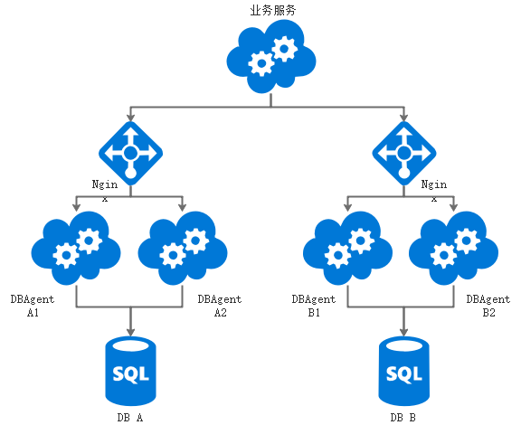

 

**DBAgent  数据库连接代理服务  V1.0.0  说明** 


# 代码简介

本微服务代码采用Eclipse开发，是一个标准的Eclipse Maven工程。

本微服务基于Spring Boot 2.1.9开发。

请用Eclipse导入此工程即可。


**以下描述内容，为此版本设计方案中需要实现的主要功能：**

- 服务提供Api接口：服务调用者可以传入SQL和指定的参数，由本服务过滤、转换后执行。包括增删改查接口。
- 服务提供者（Provider）实现接口：基于Dubbo实现Api中的接口，服务调用者提供具体的功能。
- 服务调用者（Consumer）调用示例：以DemoService为实例，展示如何调用本服务。

 

系统采用Spring Boot框架，基于Dubbo框架开发。

DBAgent作为提供者provider，为消费者consumer（如：DemoService）提供服务执行的支持。

为了便于Consumer调用Provider的接口，需要将所调用的接口单独形成一个Api接口工程，供Consumer工程使用。

由于本服务为每个数据库服务的专用代理服务，所以无法利用Dubbo Admin的统一调度管理功能，也就无法使用ZooKeeper进行服务的发现与管理。

本服务采用单机模式运行。

工作过程如下：首先提供者暴露接口；消费者连接指定IP地址的Dubbo服务接口，利用提供者实现的接口，调用接口方法来实现功能。


# 服务架构说明

本服务的调用模式如下图：




DBAgent采用SpringBoot架构，利用Dubbo框架完成服务注入的管理。DBAgent作为服务的提供者，为上层服务提供数据库连接和数据处理能力。

每个DBAgent连接一个指定的数据库。

上层服务（如DemoService）通过binding或Token在Redis中获取用户的UserInfo信息，根据其中存储的“DBAgent连接URL”，通过标准的工具类生成Service实例，访问对应的DBAgent服务。（注：此处未使用Dubbo的自动连接服务提供者功能）

即，上层服务根据访问用户所在组织的“客户数据库”对应的DBAgent连接信息，动态连接对应的DBAgent服务，实现数据访问路由的功能。

每个数据库至少运行一个DBAgent。如果运行多个，需要在其前端加入Nginx反向代理，上层微服务暴露一个唯一的地址和端口，便于上层微服务访问和实例化。


# 实现设计说明

## 功能描述

该工程为dubbo中的提供者，负责实现接口DBAgentApi中的接口，完成具体功能实现，数据库由druid提供连接。

本服务提供以下几种类型的接口：（SQL方式数据操作）

1. 原子操作：插入、修改、删除、查询记录（分别支持Object数组传参数和Map传参数）、分页查询记录（分别支持Object数组传参数和Map传参数）。
2. 批量操作（事务）：数据批量处理（不包括查询）。

## 实现逻辑

### 核心逻辑

在继承DBAgent-api接口的类上加入注解Service，version为自定义版本号，消费者调用时应与该版本号对应。如下所示：

```java
// Service注解属于dubbo包中的类（com.alibaba.dubbo.config.annotation.Service），不是spring boot的service注解，两者有区别
@Service(version = "1.0.0", timeout = 10000)
```

用druid获取数据库连接，之后使用jpa操作数据库，进行数据的增删查改，实现接口方法功能。

代码部分完成后，需要配置配置文件，配置在spring boot 默认配置文件即可，具体内容如下：

```yaml
server:
  port: 8080

dubbo:
  application:
    # dubbo提供者的别名，只是个标识
    name: dbagent
  registry:
#    address: zookeeper:////10.32.69.103:2181
    address: N/A
  #注册中心类型
  protocol:
    name: dubbo
    port: 20881
  scan:
    base-packages: com.thinkdifferent.DBAgent.service

# 以下为数据库连接配置
spring:
  datasource:
    url: jdbc:mysql://127.0.0.1:3306/udmc?characterEncoding=utf8&useUnicode=true&useSSL=false&serverTimezone=UTC
    # url: jdbc:oracle:thin:@127.0.0.1:1521:demo
    username: root
    password: root
    driver-class-name: com.mysql.cj.jdbc.Driver
    type: com.alibaba.druid.pool.DruidDataSource
    # 连接池配置
    druid:
      initial-size: 200 # 连接池初始化大小
      min-idle: 50      # 连接池最小连接数
      max-active: 2500  # 连接池最大连接数
      max-wait: 60000   # 配置获取连接等待超时的时间
      time-between-eviction-runs-millis: 60000 # 配置间隔多久才进行一次检测，检测需要关闭的空闲连接，单位是毫秒
      min-evictable-idle-time-millis: 300000   # 配置一个连接在池中最小生存的时间，单位是毫秒
      validation-query: SELECT 'x'
      test-while-idle: true # 检测连接是否有效
      test-on-borrow: true  # 申请连接时执行validationQuery检测连接是否有效。做了这个配置会降低性能。
      test-on-return: true  # 归还连接时执行validationQuery检测连接是否有效，做了这个配置会降低性能
      pool-prepared-statements: true # 是否缓存preparedStatement，也就是PSCache。打开PSCache
      max-pool-prepared-statement-per-connection-size: 20 # 指定每个连接上PSCache的大小。要启用PSCache，必须配置大于0，当大于0时，poolPreparedStatements自动触发修改为true。
      # 配置监控统计拦截的filters，去掉后监控界面sql无法统计，'wall'用于防火墙
      filter:
        stat:
          enabled: true
        wall:
          enabled: true
        log4j:
          enabled: true
      connection-properties: druid.stat.mergeSql=true;druid.stat.slowSqlMillis=5000 # 通过connectProperties属性来打开mergeSql功能；慢SQL记录
      # 监控页面配置
      stat-view-servlet:
        enabled: true
        login-username: ${spring.datasource.username}
        login-password: ${spring.datasource.password}
        allow: 127.0.0.1
        deny:
        url-pattern: /druid/*
      web-stat-filter:
        exclusions: \*.js,*.gif,*.jpg,*.png,*.css,*.ico,/druid/*
```

 

### SQL-插入：insertBySQL

```java
	/**
	 * 通过 SQL语句插入数据。SQL中的参数必须使用？作为占位符，所有参数必须通过参数列表传入
	 * 
	 * @param strSQL
	 *            输入的SQL语句
	 * @param objParams
	 *            拼装参数对象数组，可以替换SQL中的“？”对应的值
	 * @param strDBName
	 *            数据库名
	 * @return 是否插入成功 boolean
	 */
	public boolean insertBySQL(String strSQL, Object[] objParams, String strDBName) ;
```

通过参数获取数据库名（dbName，即schema）、SQL语句、参数数组（Object[]），最终传递给JdbcTemplate执行。

系统自动对接收到的SQL语句进行处理，将数据库名（dbName）加入到每一个数据表名（TableName）之前，保证操作的是用户所在的数据库。

此方法只支持通过“？”占位符配合参数数组（Object[]）传递SQL参数，避免SQL注入。

### SQL-修改：updateBySQL

```java
	/**
	 * 通过SQL语句修改数据。SQL中的参数必须使用？作为占位符，所有参数必须通过参数列表传入
	 * 
	 * @param strSQL
	 *            输入的SQL语句
	 * @param objParams
	 *            拼装参数对象数组，可以替换SQL中的“？”对应的值
	 * @param strDBName
	 *            数据库名
	 * @return 是否修改成功 boolean
	 */
	public boolean updateBySQL(String strSQL, Object[] objParams, String strDBName);
```

通过参数获取数据库名（dbName，即schema）、SQL语句、参数数组（Object[]），最终传递给JdbcTemplate执行。

系统自动对接收到的SQL语句进行处理，将数据库名（dbName）加入到每一个数据表名（TableName）之前，保证操作的是用户所在的数据库。

此方法只支持通过“？”占位符配合参数数组（Object[]）传递SQL参数，避免SQL注入。

### SQL-删除：deleteBySQL

```java
	/**
	 * 通过SQL语句删除数据。SQL中的参数必须使用？作为占位符，所有参数必须通过参数列表传入
	 * 
	 * @param strSQL
	 *            输入的SQL语句
	 * @param objParams
	 *            拼装参数对象数组，可以替换SQL中的“？”对应的值
	 * @param strDBName
	 *            数据库名
	 * @return 是否删除成功 boolean
	 */
	public boolean deleteBySQL( String strSQL, Object[] objParams, String strDBName) ;
```

通过参数获取数据库名（dbName，即schema）、SQL语句、参数数组（Object[]），最终传递给JdbcTemplate执行。

系统自动对接收到的SQL语句进行处理，将数据库名（dbName）加入到每一个数据表名（TableName）之前，保证操作的是用户所在的数据库。

此方法只支持通过“？”占位符配合参数数组（Object[]）传递SQL参数，避免SQL注入。

### SQL-查询：listBySQL（Object[]）

```java
	/**
	 * 通过SQL语句查询数据，返回List<Object>对象。一条数据也通过此方法查询。
	 * SQL中的参数必须使用？作为占位符，所有参数必须通过参数列表传入
	 * 
	 * @param strSQL
	 *            输入的SQL语句
	 * @param objParams
	 *            拼装参数对象数组，可以替换SQL中的“？”对应的值
	 * @param strDBName
	 *            数据库名
	 * @return 是否删除成功 boolean
	 */
	public List<Map<String, Object>> listBySQL(String strSQL, Object[] objParams, String strDBName);
```

通过参数获取数据库名（dbName，即schema）、SQL语句、参数数组（Object[]），最终传递给JdbcTemplate执行。

系统自动对接收到的SQL语句进行处理，将数据库名（dbName）加入到每一个数据表名（TableName）之前，保证操作的是用户所在的数据库。

此方法只支持通过“？”占位符配合参数数组（Object[]）传递SQL参数，避免SQL注入。

### SQL-分页查询：listPageDataBySQL（Object[]）

```java
	/**
	 * 通过SQL语句查询数据，返回List<Map>对象。一条数据也通过此方法查询。
	 * 
	 * @param strSQL
	 *            输入的SQL语句
	 * @param objParams
	 *            拼装参数对象数组，可以替换SQL中的“？”对应的值
	 * @param intPageSize
	 *            页面数据条数
	 * @param intPageNum
	 *            页码
	 * @param strDbType
	 *            数据库类型：oracle/mysql
	 * @param strDBName
	 *            数据库名
	 * @return 以List<Map>方式组装的查询结果集 List<Map>
	 */
	public List<Map<String, Object>> listPageDataBySQL( String strSQL, Object[] objParams, int intPageSize, int intPageNum, String strDbType, String strDBName);
```

通过参数获取数据库名（dbName，即schema）、SQL语句、参数数组（Object[]），以及分页查询所需的页面条数、页码，最终传递给JdbcTemplate执行，返回指定页的数据结果集。

系统自动对接收到的SQL语句进行处理，将数据库名（dbName）加入到每一个数据表名（TableName）之前，保证操作的是用户所在的数据库。

此方法只支持通过“？”占位符配合参数数组（Object[]）传递SQL参数，避免SQL注入。

 

### SQL-查询：listBySQL（Map）

```java
	/**
	 * 通过SQL语句查询数据，返回List<Map>对象。 该方法可传递in动态参数，具体操作方法如下： 示例：Sql ："select * from
	 * table where a =:name and b in(:names)" 参数由Map mapParams传递 , 其中Map中参数的key与
	 * SQL中"："匹配的参数名相对应,以下为组成方法
	 * 
	 * List list = new ArrayList(); list.add("name1"); list.add("name2");
	 * ........ mapParams.put("name","条件1") // 与：name对应
	 * mapParams.put("names",list) // 与：names对应 然后调用 ，
	 * listBySQL（strSQ,mapParamsL）
	 * 
	 * @param strSQL
	 *            输入的SQL语句
	 * @param mapParams
	 *            拼装参数对象数组，可以替换SQL中的“:name”对应的值
	 * @param strDBName
	 *            数据库名
	 * @return 是否删除成功 boolean
	 */
	public List<Map<String, Object>> listBySQL(String strSQL, Map<String,Object> mapParams, String strDBName) ;
```

通过参数获取数据库名（dbName，即schema）、SQL语句、参数数组（Map），最终传递给JdbcTemplate执行，返回指定页的数据结果集。

系统自动对接收到的SQL语句进行处理，将数据库名（dbName）加入到每一个数据表名（TableName）之前，保证操作的是用户所在的数据库。

此方法只支持通过“：参数名”方式占位，配合参数数组（Map，key为参数名，value为参数值）传递SQL参数，避免SQL注入。

此种方式支持SQL嵌套查询。

### SQL-分页查询：listPageDataBySQL（Map）

```java
	/**
	 * 通过SQL语句查询数据，返回List<Map>对象。 该方法可传递in动态参数，具体操作方法如下： 示例：Sql ："select * from
	 * table where a =:name and b in(:names)" 参数由Map mapParams传递 , 其中Map中参数的key与
	 * SQL中"："匹配的参数名相对应,以下为组成方法
	 * 
	 * List list = new ArrayList(); list.add("name1"); list.add("name2");
	 * ........ mapParams.put("name","条件1") // 与：name对应
	 * mapParams.put("names",list) // 与：names对应 然后调用 ，
	 * listBySQL（strSQ,mapParamsL）
	 * 
	 * @param strSQL
	 *            输入的SQL语句
	 * @param mapParams
	 *            拼装参数对象数组，可以替换SQL中的“:name”对应的值
	 * @param intPageSize
	 *            页面数据条数
	 * @param intPageNum
	 *            页面
	 * @param strDbType
	 *            数据库类型：oracle/mysql
	 * @param strDBName
	 *            数据库名
	 * @return 是否删除成功 boolean
	 */
	public List<Map<String, Object>> listPageDataBySQL(String strSQL, Map<String,Object> mapParams, int intPageSize, int intPageNum, String strDbType, String strDBName) ;
```

通过参数获取数据库名（dbName，即schema）、SQL语句、参数数组（Map），以及分页查询所需的页面条数、页码，最终传递给JdbcTemplate执行，返回指定页的数据结果集。

系统自动对接收到的SQL语句进行处理，将数据库名（dbName）加入到每一个数据表名（TableName）之前，保证操作的是用户所在的数据库。

此方法只支持通过“：参数名”方式占位，配合参数数组（Map，key为参数名，value为参数值）传递SQL参数，避免SQL注入。

此种方式支持SQL嵌套查询。

### SQL-批量处理：batchModifyBySQL

```java
	/**
	 * 通过封装的SQL语句对象，批量处理SQL操作请求。全部处理作为一个事务，失败时全部回滚。
	 * 系统根据SQLObject中的参数类型（paramType）为map还是object，调用对应的参数值。
	 * 
	 * @param listSQLObject
	 *            需要操作的SQL对象，其中包含了需要传入的参数对象，以及操作类型modifyType。
	 * @param strDBName
	 *            数据库名
	 * @return 是否删除成功 boolean
	 */
	public boolean batchModifyBySQL(List<SQLObject> listSQLObject, String strDBName) ;
```

系统通过传入的参数获取需要批量处理的SQL列表；通过循环方式，获取每个SQL对象，根据对象中的modifyType值控制执行哪个操作方法。

如果modifyType值为空，或者不符合要求，则抛出异常，终止执行，回滚SQL操作。

如果执行后返回执行失败，则抛出异常，终止执行，回滚SQL操作。

# 上线运行前置条件

- 每个DBAgent只能连接一个数据库。
- 数据库连接必须通过application.yml文件配置，与jar包同级。


# 运维信息

## Linux启动命令（示例）

nohup java  -Ddubbo.properties.file=file:///u01/application/dbconnecter-3/dubbo.properties -jar -server target/cloudcc-dbconnecter-1.0.0.jar --spring.config.location=file:///u01/application/dbconnecter/cloudcc-dbconnecter.properties &

## 启动JMX监控（示例）

nohup java -Djava.rmi.server.hostname=本机IP  -Dcom.sun.management.jmxremote -Dcom.sun.management.jmxremote.port=1099 -Dcom.sun.management.jmxremote.authenticate=false  -Dcom.sun.management.jmxremote.ssl=false -Ddubbo.properties.file=file:///u01/application/dbconnecter-3/dubbo.properties -jar -server target/cloudcc-dbconnecter-1.0.0.jar --spring.config.location=file:///u01/application/dbconnecter-3/cloudcc-dbconnecter.properties &


## Druid Monitor监控界面

Druid监控页面：访问http://127.0.0.1:8080/druid/login.html
用户密码为数据库与用户密码

 