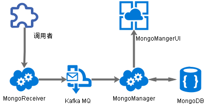

 

**MongoReceiver  日志接收服务  V1.0.0  说明** 


# 代码简介

本微服务代码采用Eclipse开发，是一个标准的Eclipse Maven工程。

本微服务基于Spring Boot 1.5.10开发。

请用Eclipse导入此工程即可。


# 服务架构说明

业务系统部分数据结构简单，但是数据量大，比如：

- Todo List：每个人都有大量的待办事宜，如果系统使用的用户量表较大，待办列表中的数据就会大量增长。
- 全文检索更新日志：为了保证数据、文件能及时更新，一般会采用独立的数据表记录每条数据、文件的更新状态，全文检索引擎通过定期扫描这张数据表，保证索引内容可以及时更新。

 

此类数据表中虽然数据量很大，但是查询逻辑相对比较简单，适合采用MongoDB存储、查询。


为了解决以上的问题，开发了本微服务。本系列服务的调用模式如下图：



**调用过程：**

- 调用者可以采用异步方式调用“MongoReceiver”的接口，“MongoReceiver”微服务提供了REST接口和Dubbo接口，调用者可以根据实际服务部署情况、实时性要求，调用相应的接口。

- “MongoReceiver”微服务：接收数据微服务，需要连接Kafka MQ服务（Kafka MQ需要先行启动）。“MongoReceiver”提供REST接口和Dubbo接口，接收到日志数据后，将日志信息推送到“Kafka MQ”的“data_topic”队列中，等待“消费端”处理。
- “MongoManager”微服务：
  - “Kafka MQ”的“消费端”，接收MQ推送过来的日志数据，逐条写入到MongoDB数据库中。
  -  日志查询管理后端服务，为“MongoManagerUI”前端程序提供后端接口，专用于数据查询。
- “MongoManagerUI”：日志查询前端页面。


**优点：**

- 调用者将数据以异步方式推送给“MongoReceiver”即可，不会影响当前操作。
- 海量的数据存储在外部的MongoDB中，减轻数据库的压力。
- MongoDB可以很方便的设置集群、分片，可以快速提升存储能力和运行效率。


# 微服务部署说明

工程通过Eclipse的”Maven Install“功能，会在Target目录中生成jar包。

将生成的“MongoReciver-1.0.0.jar”文件与工程根目录的两个properties文件放在同一个文件夹中，即可启动此微服务。

完整的部署文件夹应该包含以下文件：

- MongoReciver-1.0.0.jar：微服务文件，可执行。

- application.properties：微服务配置文件,可根据实际需求修改。各配置项说明如下（其他配置不建议修改）：
  - server.port=8888：本微服务端口。
  - spring.kafka.producer.bootstrap-servers=127.0.0.1:9092：kafka服务的地址和端口
  - spring.dubbo.registry.address=N/A：dubbo注册中心地址。如果配置成“N/A”，则为“不注册模式”（单机模式）；正常应配置为如下格式内容zookeeper://ip:2181

- dubbo.properties：dubbo连接数配置文件

- startup.bat：Windows版启动脚本。内容如下：
  
`java -jar -Xms1g -Xmx1g ./MongoReciver-1.0.0.jar`
  
- startup.sh：Linux版启动脚本。内容如下：
  
  `nohup  java -jar -Xms1g -Xmx1g ./MongoReciver-1.0.0.jar  2>&1 &`


# 微服务运行说明

本微服务依赖 Kafka MQ，需要先将需要连接的Kafka MQ服务先行启动。

启动本微服务时，只需执行“startup.bat”或“startup.sh”即可。

或可以在命令行窗口执行：

`java -jar -Xms1g -Xmx1g ./MongoReciver-1.0.0.jar`

其中Xms是设置最小内存；Xmx是设置最大内存。可以根据实际情况修改内存大小。

**注意：**在Windows中，执行微服务后，命令行窗口不能关闭！否则此java进程会随之关闭！！！

 

# 接口调用说明

## REST接口

### 发送数据

接口地址：http://127.0.0.1:8888/api/setData

输入参数：

插入数据：

```json
{
    "table": "union_todo_list",
    "operation": "insert",
    "dataID": "202001262139",
    "data": {
         "creator": "wld",
         "pcurl": "/showtask.aspx?id=A00000000007"
    }
}
```

 

更新数据：（更新哪个字段，在data中写哪个字段和值。）

```json
{
    "table": "union_todo_list",
    "operation": "update",
    "query": [{
         "field": "dataID",
         "condition": "=",
         "value": "202001262054"
    }],
    "data": {
         "creator": "dadr23erwerwer"
    }
}
```

 

删除数据：

```json
{
    "table": "union_todo_list",
    "operation": "delete",
    "dataID": "202001262139"
}
```

 

说明：

- table：表名
- operation：操作。insert、update、delete
- dataID：数据ID。
- data：数据内容。
- query：查询内容。


## Dubbo接口

```java
@Service(version = "1.0.0") 
com.thinkdifferent.MongoDBReciver.dubbo.service.MongoDBService
```


### 发送数据

```java
  /**
   * 发送数据
   * @param joData 数据信息，以JSONObject形式传送
   * @return
   */

  public boolean sendData(JSONObject joData);
```

 
